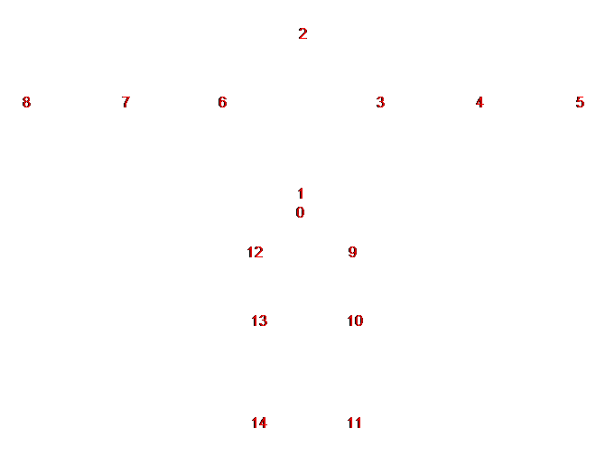

# HIR - Model skeleton

Skeleton used for pigs

```c
foreach(bone) //sizeof = 20
{
    4   int     bone.ParentIndex

    //Transform16
    2   short   bone.Transform.X
    2   short   bone.Transform.Y
    2   short   bone.Transform.Z
    2   short   bone.Transform.W    //padding

    //Rotation16
    2   short   bone.Rotation.X
    2   short   bone.Rotation.Y
    2   short   bone.Rotation.Z
    2   short   bone.Rotation.W
}
// EOF
```

| Index | Bone 
| ----- | ----- 
| 0     | Hip
| 1     | Spine
| 2     | Head
| 3     | UpperArm.L
| 4     | LowerArm.L
| 5     | Hand.L
| 6     | UpperArm.R
| 7     | LowerArm.R
| 8     | Hand.R
| 9     | UpperLeg.L
| 10    | LowerLeg.L
| 11    | Foot.L
| 12    | UpperLeg.R
| 13    | LowerLeg.R
| 14    | Foot.R


